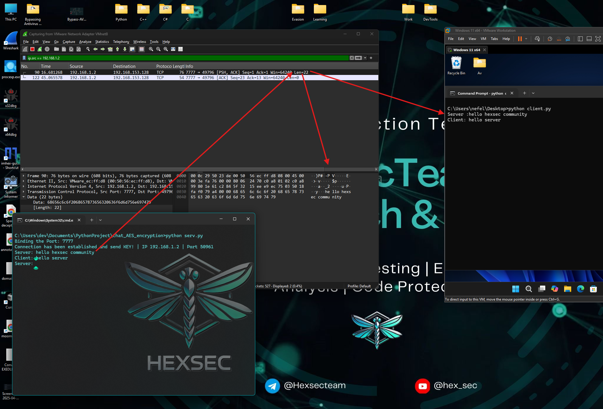
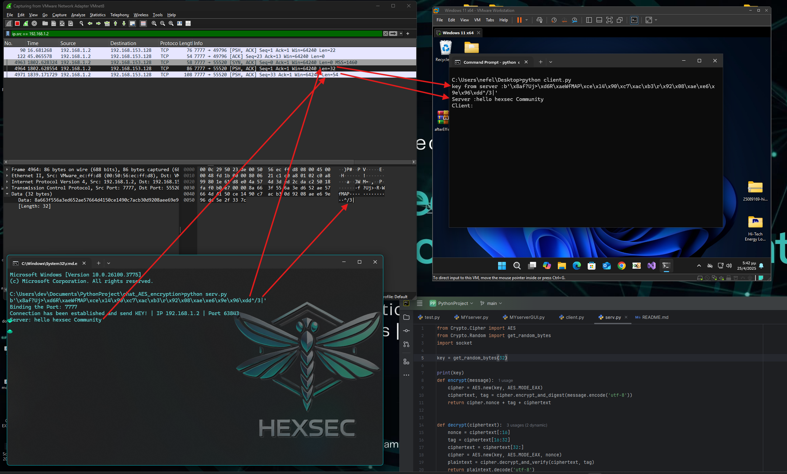

# 🔐 AES Encrypted Multi Client-Server in Python

## Overview

This project demonstrates a simple but powerful **client-server chat application** built in Python. It uses **AES-256 encryption** in **EAX mode** to ensure **confidentiality, integrity, and authenticity** of all exchanged messages between the server and the client.

The main features:

- Encrypted communication using `pycryptodome`
- Real-time chat over local network
- Easy to use and understand
- Demonstrated network visibility with Wireshark before and after encryption

---

## 🌐 Network Setup

- **Server** runs on a **host PC**.
- **Client** runs inside a **VMware virtual machine**.
- Both systems are connected via the same **LAN**.
- **Wireshark** is used to inspect traffic:
  - 🔓 Before AES: Messages are visible in plaintext.&#x20;
  - 🔐 After AES: Messages appear as ciphertext and are unreadable.&#x20;

---

## 📦 Installation

Clone the repository:

```bash
git clone https://github.com/hexsecteam/AES-Encrypted-Multi-Client-Server-in-Python-DEMO-.git
cd aes-chat
```

Install the required Python module:

```bash
pip install pycryptodome
```

---

## 🛠 Running the Chat

### On the Server:

```bash
python serv.py
```

### On the Client (in VMware or another PC):

```bash
python client.py
```

---

## 📁 File Structure

### `serv.py` (Server)

This script acts as the server. It generates the AES key, listens for a client connection, and handles sending and receiving encrypted messages.


### `client.py` (Client)

The client connects to the server and uses the shared key to securely exchange messages.


---

## 🎓 How It Works

1. **Key Generation**: Server generates a 256-bit AES key using `get_random_bytes()`.
2. **Key Exchange**: The key is sent once to the client when it connects.
3. **Encryption Process**:
   - Uses AES in EAX mode to encrypt and generate a `tag`.
   - Final data = `nonce + tag + ciphertext`
4. **Decryption Process**:
   - Extracts `nonce`, `tag`, and actual message.
   - Uses same AES key and nonce to decrypt and verify integrity.

---

## 🔍 Wireshark Demonstration

- **Without AES**: Plaintext messages like `hello hexsec community` are fully visible.

- **With AES**: Messages appear encrypted (e.g., `\x96\x3d...`) and unreadable.

📢 This confirms the importance of encrypting sensitive data even on local networks.

---

## 🔧 Future Features

- Implement **RSA** or **Diffie-Hellman** for secure key exchange
- Add a **GUI** using Tkinter or PyQt
- Allow multiple clients (multi-threaded server)
- Add **user authentication** and **logging**

---

## 💪 Credits

Developed with ❤️ by **@HexsecTeam**

> 🧠 This tool is meant for **educational** and **ethical hacking** research only. Always use responsibly.

---

## 🤝 Support the HexSec Community

If you appreciate our work and want to help us grow, you can contribute by making a donation. Your support allows us to keep creating secure, innovative tools for the community.

### 🪙 Donate

- **ETH:** `0x3E79B73e3ce33c6B860425DCB40c6D2f4F2aC508`
- **BTC:** `bc1qpex9u7x4a6kj4nf6fee7mz54vsv4th2rj2pt30`

### 📞 Contact

- Telegram Contact: [@Hexsecteam](https://t.me/Hexsecteam)
- Telegram Group: [@hexsec\_tools](https://t.me/hexsec_tools)

---

🔹 Cybersecurity | Secure Development | Ethical Research | Security Engineering


